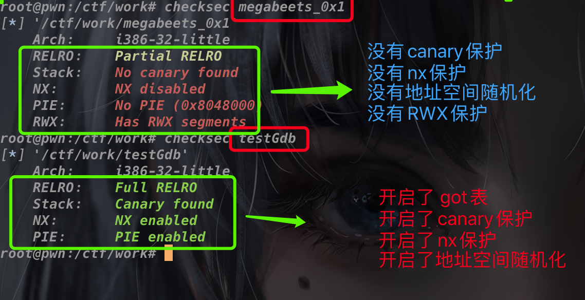

# Pwn_Love

Pwn入门学习笔记


## 环境搭建  
推荐Ubuntu 18.04及以上，个人用的是Deepin或Kali Linux  
```bash
sudo apt-get update  
sudo su  
sudo apt-get install python2.7 python-pip python-dev git libssl-dev libffi-dev build-essential  
sudo pip install --upgrade pip
sudo apt-get install git gdb gdb-multiarch
sudo apt-get install "binfmt*" 
git clone https://github.com/pwndbg/pwndbg
cd pwndbg
./setup.sh
sudo ./setup.sh
sudo pip install pwntools
sudo apt-get install qemu-user
sudo apt-get install gcc-multilib
```  
  

<br/>

Mac系统上我用的是docker  
https://hub.docker.com/r/skysider/pwndocker  
```
docker run -d \
    --rm \
    -h ${ctf_name} \
    --name ${ctf_name} \
    -v $(pwd)/${ctf_name}:/ctf/work \
    -p 23946:23946 \
    --cap-add=SYS_PTRACE \
    skysider/pwndocker

docker exec -it ${ctf_name} /bin/bash
```
<br/>
<br/>

## 基础知识
个人觉得Pwn的前置技能需要如下：
- 汇编基础
- GDB调试基础   
  以上基础可参考系列文章。
<br/>
<br/>

## 溢出
overflow.c
```c
#include <stdio.h>
int main()
{
  char str[2];//实际只有2个元素
  read(0,str,3);//但是却读取了3个字节，导致溢出!
}
```


## 常见保护理论知识
- Canary 栈保护  
栈保护，在段首置入随机Cookie，当溢出Shellcode覆盖后 进行校验，从而判断是否被修改。
- Fortify   
防止缓冲区溢出
- NX (DEP)  
No-Execute，将数据所在内存页标记为不可执行状态，从而防止Shellcode覆盖内存数据执行恶意代码。
- PIE (ASLR)  
地址空间随机化
- RELRO
got表

### 查保护命令
```bash
checksec 文件名
```
  

### 关闭保护命令
```bash
#栈保护 stack protector
#pie地址随机化
#no  execute 

gcc -no-pie -fno-stack-protector -z execstack noprotector_demo test.c
chmod 777 noprotector_demo
```


## 基础系列文章
## [《GDB调试基础》](./gdb_basic/readme.md)
<br/>

## PWN系列课程文章收集
## [《零基础入门PWN》](https://www.kanxue.com/book-57-853.htm)
## [《从0开始CTF-PWN》](https://bbs.pediy.com/thread-259272.htm)
## [《从入门到秃头之PWN蛇皮走位》](https://mp.weixin.qq.com/s/pEIKHPO-STNUM4VWE7pPng)
## [《CTF 竞赛入门指南PWN篇》](https://www.bookstack.cn/read/CTF-All-In-One/doc-3_topics.md)