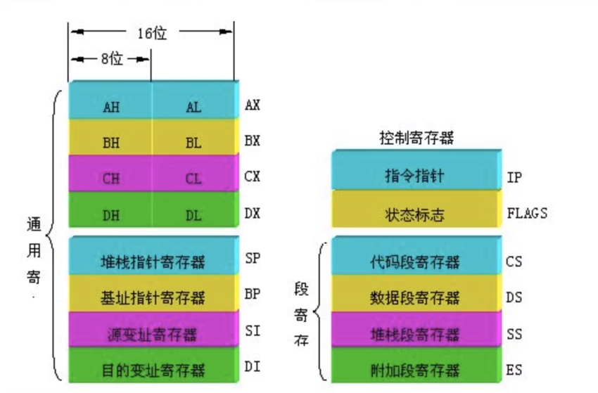

### 汇编基础：

#### 汇编架构

32位系统下 X86架构下的汇编指令主要又两种格式 一个是intel  ,一个是AT & T

- Intel架构寄存器       比如：EAX EBX ECX EDX
- AT & T架构寄存器   比如:    %eax %ebx %ecx %edx   $ebx $ecx $edx

```shell
"配置 Ubuntu gdb 默认调试架构为Intel的方法"
.gdbinit = set disassembly-flavor intel
```


#### 寄存器
通用寄存器：EAX EBX ECX EDX

- ESP 用来存储函数调用栈的栈顶地址，push pop 压栈 退栈时候改变
- EBP 用来存储当前函数状态的基地址  [函数参数、局部变量位置]
- EIP 用来存储即将执行的程序指令的地址 [这和8086的不太一样，他妈的白学了么8086的，8086的是当前程序指令执行的地址 = cs:ip ]


一张图来了解所有寄存器


.


#### 栈帧

什么是堆帧呢？

我自己的理解是，栈帧其实就是一个函数执行的环境，就是一个函数执行的时候，他的函数参数、函数的局部变量，函数执行完返回的地址。

```c++
"因为在C语言里面，所有的功能操作都可以封装成一个函数，包括我们入口点也是一个函数 Main函数"
//举例
int Function1()
{
    #功能1
    int a = 1;
    int b = 2; "像这种临时变量，就会在栈帧里面"
    return a+b; "返回值,还有函数返回后出来的地址"
}

void Function2(int a,int b)
{
    #功能2
    return b-a; "函数参数，也是在栈帧里."
}

void Main()
{
    Function1();
    Function2(a,b);
}
```
##### 栈

那什么是栈呢？

栈其实我的理解就是一个杯子。


.

```c++
#水杯，他里面有容量就和栈一样
#水杯，他地址从最下面开始，也就是从低到高。
#水杯，你往里面加水就是 push ,就是压栈。 被压入的数据存在低地址，也就是水杯地下。
#水杯，你往外面倒水就是 Pop , 就是弹栈， 对计算机来说，pop ，就是取数据，就是取高地址数据，一般被压入的最后取出，也就是
#first in , Last out,先进后出，最早被压入的数据，最后取出来。
```

