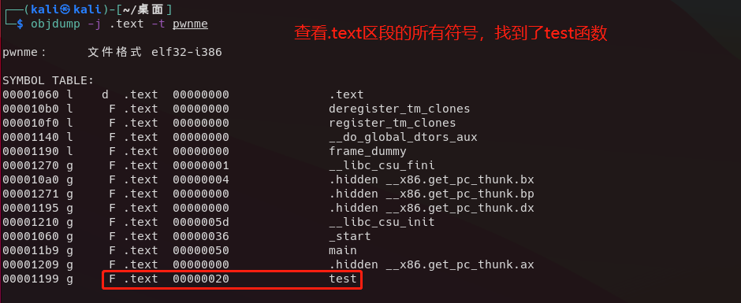
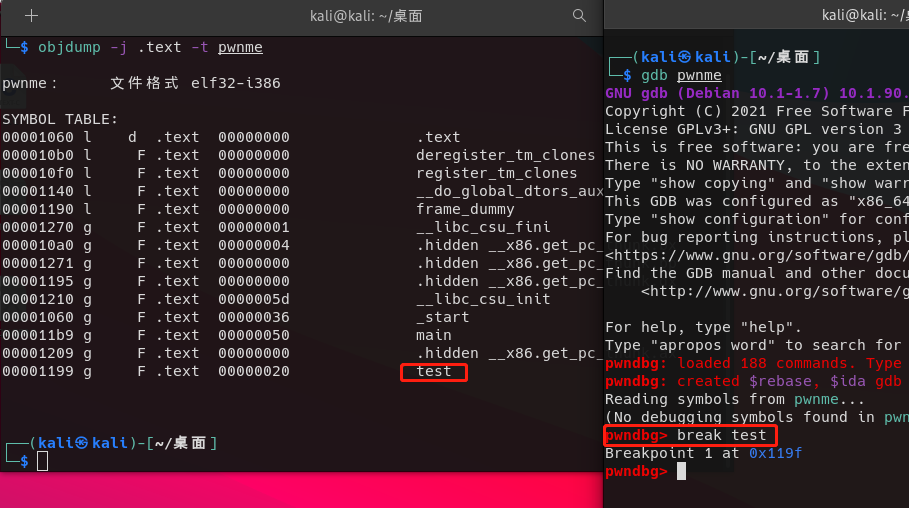

# GDB调试基础  
## [objdump详细使用教程](./objdump/readme.md)  
## [readelf详细使用教程](./readelf/readme.md)  
## [radare2学习笔记](./radare2/readme.md)  
## 前言
GDB（GNU Debugger）是UNIX及UNIX-like下的强大调试工具，可以调试ada, c, c++, asm, minimal, d, fortran, objective-c, go, java,pascal等语言。本文以C程序为例，介绍GDB启动调试的多种方式。
<br/>
<br/>

## 查看文件头信息
### #readelf （个人喜欢）
```
readelf -h pwnme
```
### #objdump
```
objdump -f pwnme
```
  

<br/>
<br/>

## 查看段信息

### #readelf（个人喜欢）
```
readelf -S pwnme
```
  
### #objdump
```
objdump -h pwnme
```
  
### #Detect-It-Easy
  
<br/>
<br/>

## 查看符号表

### #readelf
```
readelf -s pwnme
```
  
### #objdump
```
objdump -t pwnme
```
  

### radare2（个人喜欢）
```
r2 pwnme
aaa
afl
```
  

<br/>
<br/>

## 查看某函数的汇编代码
```
objdump -j .text -M intel --no-show-raw-insn -d xxx | awk -v RS= '/^[[:xdigit:]].*<test>/'
```
  
  
<br/>
<br/>

## 调试启动带参程序
```bash
#直接用run 加参数即可
gdb debugme
(pwndbg)run hacker
Hello World hacker!
(pwndbg)
#或者用set args
(pwndbg)set args hacker argument2 argument3 argument4
(pwndbg)run
```
  
  
## 附加调试程序
```
ps -ef | grep "calc"
gdb
(pwndbg)attach 2644
```
  
<br/>
<br/>

## 断点设置
### 查看断点信息
```bash
#infomation breakpoints
info breakpoints
```
  
  
### 根据函数名设置断点
```bash
break main
break test
break function
```
  
  
### 根据条件设置断点
```
break 1.c:16 if argc==1
```
  
  
### 根据规则设置断点
```bash
#设置所有以test开头的函数断点
rbreak test* 
rbreak ^test
#设置所有函数的断点
rbreak .
#总之rbreak后面就是规则

#临时断点，只会运行一次
tbreak xxx
tbreak test
tbreak *地址
tbreak 1.c:7
```
  
  

### 跳过多次设置断点
```
ignore 断点序号 要跳过的次数
ignore 1 33
```
  

### 禁用、启用、删除断点
```bash
#禁用
disable #所有
disable 标号 #禁用某序列号断点
#启动
enable 
enable 标号
enable delte 标号 #启动某标号断点后，自动删除
#断点清除
clear #所有，这个好像没有用
clear function #删除某函数断点
delete #这个是删除所有的有效果
delete 标号
```
<br/>

## 打印寄存器，显示内存地址
  
```bash
p + 变量名 打印变量信息
p $eax #默认十进制
#按照格式打印
p/x $eax
p/c $eax
p/a $eax
```
  
```bash
x/20ab #显示20个字节，十六进制格式，类型字节
x/20aw #显示20个地址，十六进制格式，类型DWORD 4字节
```


---
> https://www.yanbinghu.com/2019/04/20/41283.html  
> https://linuxtools-rst.readthedocs.io/zh_CN/latest/tool/gdb.html  
> https://chujian521.github.io/blog/2020/03/01/GDB%E9%80%86%E5%90%91%E8%B0%83%E8%AF%95%E5%88%86%E6%9E%90/  
> https://wiki.ubuntu.org.cn/%E7%94%A8GDB%E8%B0%83%E8%AF%95%E7%A8%8B%E5%BA%8F  
